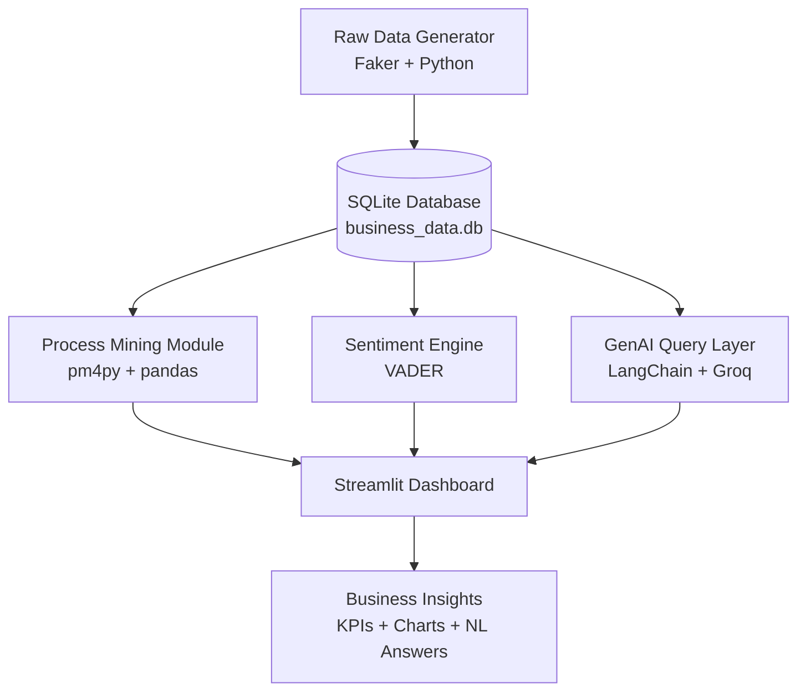

# 🤖 AI Business Intelligence Copilot


## Executive Summary

AI BI Copilot is a locally-runnable, portfolio-grade analytics platform that combines **Process Mining**, **NLP Sentiment Analysis**, and a **GenAI Query Interface** into one cohesive system. It generates realistic synthetic business data, analyses it across multiple dimensions, and surfaces insights through an interactive Streamlit dashboard — all powered by open-source tools and Groq-hosted LLMs.

---

## Architecture



---

## Features

| Module | Description |
|---|---|
| 📊 **Business Overview** | KPI cards, revenue by region, monthly revenue trend |
| ⚙️ **Process Mining** | Cycle time analysis, bottleneck detection using pm4py |
| 💬 **Sentiment Analysis** | VADER-powered review classification with category drill-down |
| 🤖 **GenAI Query** | Natural language → SQL → plain-English answers via LangChain + Groq |

---

## Tech Stack

| Layer | Technology |
|---|---|
| Language | Python 3.11+ |
| Database | SQLite via SQLAlchemy |
| Data Generation | Faker |
| Process Mining | pm4py, pandas |
| Sentiment Analysis | VADER (vaderSentiment) |
| GenAI / NL-to-SQL | LangChain, LangChain-Groq, Groq LLM |
| Dashboard | Streamlit + Plotly |
| Notebooks | Jupyter / ipykernel |

---

## Quick Start

```bash
# 1. Clone the repository
git clone https://github.com/Abhinav15s/ai-bi-copilot.git
cd ai-bi-copilot

# 2. Install dependencies
pip install -r requirements.txt

# 3. Add your Groq API key
cp .env.example .env
# Edit .env and replace "your-groq-api-key-here" with your actual key

# 4. Generate synthetic data
python data/generate_data.py

# 5. Launch the dashboard
streamlit run dashboard/app.py
```

The dashboard will open at `http://localhost:8501`.

---

## Sample Questions (Ask the Copilot)

- *"Which region had the highest revenue last quarter?"*
- *"What is the average cycle time for order fulfilment?"*
- *"Show me the top 3 product categories with the most negative customer reviews."*
- *"What percentage of orders were delayed by more than 2 days?"*
- *"Who are the top 5 sales reps by total revenue?"*
- *"What is the revenue vs cost margin for each product category?"*

---

## Project Structure

```
ai-bi-copilot/
├── README.md                        # This file
├── requirements.txt                 # Python dependencies
├── .env.example                     # Environment variable template
├── .gitignore
├── data/
│   └── generate_data.py             # Synthetic data generator (Faker)
├── sql/
│   ├── schema.sql                   # SQLite schema DDL
│   └── queries.sql                  # 12 analytical SQL queries
├── modules/
│   ├── __init__.py
│   ├── db.py                        # SQLAlchemy helpers
│   ├── process_mining.py            # pm4py cycle time & bottleneck analysis
│   ├── sentiment_engine.py          # VADER sentiment classifier
│   └── genai_query.py               # LangChain NL-to-SQL layer
├── dashboard/
│   └── app.py                       # Streamlit multi-page dashboard
└── notebooks/
    └── exploration.ipynb            # EDA walkthrough
```

---

## Roadmap

- **Week 2**: Add DuckDB support for larger datasets; integrate Hugging Face transformer for sentiment
- **Month 1**: Deploy to Streamlit Cloud with secrets management; add user authentication
- **Month 2**: Integrate with real CRM/ERP data sources via REST APIs; add BPMN diagram export
- **Month 3**: Fine-tune a domain-specific LLM for more accurate SQL generation; add forecasting with Prophet

---

## Author

Built by [Abhinav15s](https://github.com/Abhinav15s) as a portfolio demonstration of applied AI + analytics engineering.